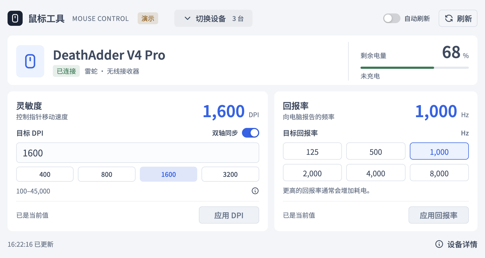

# MouseControl · Razer, Logitech & MCHOSE Mouse Utility

[中文](README.md) · **English** · [Download](https://github.com/Vex9th/mouse-control/releases/latest) · [Report an issue](https://github.com/Vex9th/mouse-control/issues/new?template=bug_report.yml)

A lightweight **Windows mouse battery monitor and settings tool** for **Razer and Logitech** mice. Check battery level, charging status, current DPI and polling rate, then adjust supported settings through a desktop GUI or CLI. Multiple devices are identified separately. MCHOSE new-protocol mice have experimental read-only support.

**The application interface and CLI messages are currently in Simplified Chinese.** This README provides English installation and usage instructions.



*The screenshot uses demo data. Actual readings and available settings depend on the connected device.*

## Download and run

For **Windows 10 / 11 x64**. Download from [Releases](https://github.com/Vex9th/mouse-control/releases/latest):

| File | Purpose |
| --- | --- |
| `MouseControl-1.5.2-windows-x64.zip` | Portable GUI. Extract and run `MouseControl.exe`. |
| `RazerBattery-1.5.2-windows-x64.zip` | Portable CLI, help and third-party notices. Extract and run `RazerBattery.exe` for the interactive menu. |
| `SHA256SUMS.txt` | SHA256 checksums for the downloads. |

The GUI requires **Microsoft Edge WebView2 Runtime**. Windows 11 includes it; if missing, install the Evergreen Runtime from [Microsoft](https://developer.microsoft.com/microsoft-edge/webview2/). Running the application does not require Node.js, Python or Go.

1. Connect your mouse or wireless receiver and launch the application.
2. Select the device at the top to inspect battery, DPI and polling rate.
3. Enter a DPI value or select a polling rate, then click the corresponding apply button. The application reads the value back to confirm it.
4. Open “设备详情” (Details) for the complete device identity, capabilities and errors. Device lists and long messages use pagination.

No background service, account or startup entry is installed. The GUI and Chinese font are embedded in the executable, without a local HTTP server or online font dependency. Refresh manually or enable a 30-second interval; automatic refresh pauses while there are unapplied edits.

## Features

- **Battery monitoring:** Percentage and charging state where available; otherwise the actual battery level or voltage. Missing readings are not displayed as 0%.
- **DPI control:** Device-reported ranges and steps, with separate X/Y values on devices that support them.
- **Polling-rate control:** Available rates come from device capabilities. Some devices expose 125–8000 Hz.
- **Multiple devices:** Distinct device identities, including separate slots on supported Logitech receivers.
- **GUI and CLI:** A compact Vue 3 + Naive UI desktop interface, interactive CLI menu, one-shot queries and periodic output.
- **Compact layout:** Default client area of 900×480 logical pixels, minimum 760×440. Device lists, details and long messages are paginated.
- **Read-back verification:** Unchanged values skip writes. Timeouts and mismatches remain visible errors; settings are not automatically retried.
- **Diagnostics:** View and copy reports from an error dialog or “诊断日志” (Diagnostics) at the bottom. Open the GitHub issue template and submit the report yourself.

## Compatibility

| Device or connection | Implementation | Verification |
| --- | --- | --- |
| Razer USB / wireless receivers | 113 mouse-related PIDs; XY DPI support for 101, polling-rate support for 104 | DeathAdder V4 Pro wireless has hardware read and settings/restore tests. Other entries primarily rely on protocol references. |
| Logitech HID++ 2.x mice and trackballs | Dynamic discovery of battery, DPI and polling-rate features | Protocol simulation tests; no Logitech hardware verified by this project yet. |
| LIGHTSPEED / POWERPLAY / Unifying / Bolt / Nano | Known receiver discovery, slot queries and mouse identity checks | 34 receiver-related PIDs; some legacy entries are identification-only. |
| Logitech direct USB / Bluetooth | Queries when Windows exposes a usable HID++ channel | Specific devices and Bluetooth paths still require hardware testing. |
| MCHOSE new-protocol USB / 2.4 GHz | 14 mouse PIDs and 3 receiver PIDs; battery, current DPI and polling rate reads | Experimental, based on the official web driver; protocol simulations only, no real-device verification; settings disabled |
| HID++ 1.x / generic HID / legacy proprietary protocols | Identification or legacy battery readings where implemented | Unsupported settings remain unavailable. |

**A catalog entry or implemented protocol is not a guarantee that every model, connection or feature works.** The project does not manage keyboards, headsets, button remapping, macros, lighting, firmware updates or complete onboard profiles. It is not a full replacement for Razer Synapse, Logitech G HUB or Options+.

Detailed technical references are currently in Chinese: [Razer models and protocols](docs/MOUSE_PROTOCOL.md), [Logitech HID++](docs/LOGITECH_PROTOCOL.md), [receivers and Bluetooth](docs/LOGITECH_RECEIVERS.md), [MCHOSE protocol and supported models](docs/MCHOSE_PROTOCOL.md), [read-only MCHOSE capture instructions](docs/MCHOSE_CAPTURE.md), and [verification scope](docs/COMPATIBILITY.md).

## CLI usage

```powershell
# Read once
.\RazerBattery.exe -once

# Show complete device identity, capabilities and errors
.\RazerBattery.exe -details

# Refresh every 30 seconds
.\RazerBattery.exe -watch 30

# Set DPI, with optional separate X/Y values
.\RazerBattery.exe -set-dpi 1600
.\RazerBattery.exe -set-dpi 1600,1200

# Set polling rate
.\RazerBattery.exe -set-rate 1000

# Show the device catalog and help
.\RazerBattery.exe -supported
.\RazerBattery.exe -h
```

Running without arguments opens the Chinese interactive menu. When input or output is redirected, the default is a single query. For multiple connected devices, settings commands require the full device ID copied from `-details`:

```powershell
.\RazerBattery.exe -set-dpi 1600 -device 'full-device-id-from-details'
```

A disconnected selection never redirects a setting to another mouse. Some Razer devices persist DPI changes. Logitech devices in onboard mode may reject settings; the application does not switch modes or write profile flash automatically.

## FAQ

**Does it need to keep running?** No. Open it to read or change settings and close it when finished. There is no resident service or automatic startup.

**Why is a value unknown or unavailable?** The mouse may be asleep, disconnected or powered off, or its current connection may not expose that feature. Move the mouse and refresh. If an error remains, view and copy its report from the error dialog or “诊断日志” (Diagnostics) at the bottom. Battery levels or voltages are not converted into fabricated percentages.

**Can it run alongside vendor software?** Applications may compete for the same device channel or settings. If communication fails, close other mouse-management software before retrying a read. All coexistence combinations have not been tested.

**Is there a browser version?** This release is a Windows desktop application. A browser version could reuse the Vue UI, but would need a separate WebHID transport, permission flow and device testing. The Go Windows HID backend cannot run directly in a web page.

## Automatic builds

Pushes to `main`, pull requests and manual [Actions](https://github.com/Vex9th/mouse-control/actions/workflows/windows.yml) runs test and build both Windows x64 applications. Artifacts include portable GUI and CLI ZIPs, licenses and SHA256 checksums, retained for 7 days. New commits cancel older runs for the same branch.

A matching `v*` source-version tag creates a Release automatically; existing releases are never overwritten. CI does not access real mice, run settings tests or copy files to personal computers.

MCHOSE support is limited to the documented new protocol. Other G3/G7 protocol families and Bluetooth are not covered; actual device compatibility remains unverified.

## Build from source

Requires Go 1.23+, Node.js 22.12+, Bun and Python 3. Windows x64 is recommended for building and validating runtime behavior.

```powershell
git clone https://github.com/Vex9th/mouse-control.git
cd mouse-control

# Frontend tests, type checking, bundling and Windows GUI build
python scripts/build-gui.py

# Go tests and standalone CLI
cd go
go test ./...
go build -trimpath '-ldflags=-s -w' -o ../dist/RazerBattery.exe .
```

The GUI is written to `dist/MouseControl.exe`. Dependency versions are recorded in the project lockfiles. The first build needs network access to download dependencies. macOS and Linux can cross-compile the Windows GUI; a successful cross-build does not prove Windows runtime behavior. See the [development guide](docs/DEVELOPMENT.md) for preview, native tests and packaging.

## Feedback and references

When an error occurs, open its dialog or “诊断日志” (Diagnostics) at the bottom and click “复制诊断日志” (Copy diagnostics). “提交 Issue” (Report an issue) opens the fixed [GitHub issue template](https://github.com/Vex9th/mouse-control/issues/new?template=bug_report.yml). Fill in the mouse model, connection type, application and Windows versions, reproduction steps and actual result, then paste the report into Diagnostics. Review and submit the issue yourself; the application never sends logs or creates an issue automatically.

Reports are automatically redacted, but review their contents before posting. Account details, serial numbers and full device paths are not needed. If the application cannot open or the report cannot be copied, explain that in the template.

Local errors are stored in a single `%LOCALAPPDATA%\MouseControl\logs\error.log` file, limited to 20 records and 128 KiB. Consecutive duplicate errors are merged with an occurrence count. If saving fails, the application reports the failure and still lets you copy the current in-memory diagnostic report.

Maintained by [Vex9th](https://github.com/Vex9th). Protocol references include [OpenRazer](https://github.com/openrazer/openrazer), [Logitech HID++ documentation](https://github.com/Logitech/cpg-docs), [Solaar](https://github.com/pwr-Solaar/Solaar), [libratbag](https://github.com/libratbag/libratbag), Linux HID drivers and the [official MCHOSE web driver](https://www.mchose.com.cn/#/connectDevice). Pinned versions and field references are documented in the protocol guides. Dependency and font licenses are preserved in [Third-party notices](docs/THIRD_PARTY_NOTICES.txt).

This project is not affiliated with Razer, Logitech or MCHOSE. Brand and product names belong to their respective owners.
